# RecoverAI-v2

> **Autonomous Payment Recovery Decision Engine with Deterministic Safety Guardrails & Economic Expected-Value Optimization**

```
AI RECOMMENDS. ECONOMICS EVALUATES. POLICY ENGINE DECIDES.
```

RecoverAI is a portfolio-grade decisioning system designed to solve payment recovery safely. Instead of relying on rigid, blind retries that increase customer churn and waste bank gateway fees, RecoverAI pairs **contextual AI root-cause diagnosis** with **expected-value economic scoring** and **deterministic policy guardrails**.

*Originally engineered for the **Razorpay AI Buildathon 2026 (Track 03: AI Revenue Recovery Agent)** and evolved into a production-grade decision architecture.*

---

## ⚡ 60–90 Second Recruiter Demo Flow

If you are evaluating this project in a quick demo, follow this 5-step sequence:

1. **Review 3-Way Comparative Economics (Overview Tab):**
   * Inspect the side-by-side performance comparison: **RecoverAI** vs. **Static Rule-Based Baseline** vs. **Naive Blind 3x Retries**.
   * Observe how RecoverAI achieves **~73.5% revenue recovery** (84% transaction recovery) on Seed 42 while eliminating wasted retries and preserving **₹26.7L+** in revenue.
2. **Inspect Live 5-Stage Decision Pipeline (Transactions Tab):**
   * Click **Diagnose** on the highlighted demo transaction **`pay_fail_046_5050`** (`DO_NOT_HONOR`).
   * Trace the execution through all 5 layers:
     * **Stage 1 (Ingestion & Risk):** Computes multidimensional risk score and telemetry.
     * **Stage 2 (AI Diagnosis):** Proposes advisory action `RETRY` with confidence `0.62` (advisory only).
     * **Stage 3 (Candidate Economics):** Calculates expected net payoff matrix across all candidate actions.
     * **Stage 4 (Policy Engine Override):** **Confidence Threshold Guard** detects confidence $0.62 < 0.65$ threshold and intervenes, overriding `RETRY` $\rightarrow$ `ESCALATE`.
     * **Stage 5 (Simulated Outcome):** Safely routes the payment to VIP human review without firing unsafe gateway retries.
3. **Verify Zero-Tolerance Fraud Protection:**
   * Click the **"Fraud Contained (5)"** filter button in the table.
   * Notice that $5/5$ suspected fraud events trigger the **Fraud Zero-Tolerance Guard** (`NO_ACTION`), preventing chargeback penalties and recording ₹0 revenue claimed.
4. **Inspect Immutable Audit Trail (Audit Trail Tab):**
   * Inspect structured decision logs capturing full telemetry, model rationales, applied rule IDs, and execution outcomes.
   * Verify duplicate event blocking enforced by the **Atomic Idempotency Layer**.
5. **Inspect 20-Seed Robustness Evaluation (Comparison Drawer):**
   * Open the multi-seed evaluation drawer in the Overview tab to view aggregate performance across **20 random seeds (2,000 synthetic transactions)** showing consistent recovery uplift without variance overfitting.

---

## 🏗️ System Architecture & Zero-Trust Boundary

RecoverAI strictly enforces a **Zero-Trust Execution Invariant**: *Probabilistic AI models are isolated as advisory agents and have ZERO direct authority to move money or trigger payment gateway executions.*

```mermaid
graph TD
    A[Payment Failure Telemetry] --> B[1. Idempotency & Risk Assessment]
    B -->|Event Validation & Risk Profile| C[2. AI Diagnostic Layer]
    C -->|Advisory Root-Cause & Proposal| D[3. Candidate Economic Evaluation]
    D -->|Expected Net Payoff Matrix| E[4. Deterministic Policy Engine]
    E -->|Enforce Hard Guardrails & Overrides| F[5. Simulated Execution & Audit Trail]
    
    subgraph Advisory Domain
        C
    end
    
    subgraph Final Execution Authority
        E
        F
    end

    style C fill:#1e293b,stroke:#0284c7,stroke-width:2px
    style D fill:#1e293b,stroke:#d97706,stroke-width:2px
    style E fill:#1e293b,stroke:#059669,stroke-width:2px
    style F fill:#1e293b,stroke:#6366f1,stroke-width:2px
```



### The 5 Decision Stages

```text
Payment Event
      │
      ▼
┌─────────────────────────────────────────────────────────┐
│ 1. IDEMPOTENCY & STRUCTURED RISK ASSESSMENT             │
│ • Atomic unique event_id deduplication                  │
│ • Multidimensional risk profiling (Exposure, Fraud)    │
└────────────────────────────┬────────────────────────────┘
                             │
                             ▼
┌─────────────────────────────────────────────────────────┐
│ 2. CONTEXTUAL AI DIAGNOSTIC LAYER (ADVISORY ONLY)       │
│ • Root-cause diagnosis & contextual rationale           │
│ • Confidence scoring signal                             │
│ • Proposed recovery action (Zero direct authority)      │
│ • Deterministic heuristic fallback if offline           │
└────────────────────────────┬────────────────────────────┘
                             │
                             ▼
┌─────────────────────────────────────────────────────────┐
│ 3. CANDIDATE ECONOMIC VALUATION                         │
│ • Expected gross recovery estimation                    │
│ • Gateway & operational intervention costs              │
│ • Expected net payoff: E[Net] = P(Success)*Gross - Cost │
│ • Candidate action comparison matrix                    │
└────────────────────────────┬────────────────────────────┘
                             │
                             ▼
┌─────────────────────────────────────────────────────────┐
│ 4. DETERMINISTIC POLICY ENGINE (THE FINAL AUTHORITY)    │
│ • Action whitelist enforcement                          │
│ • Fraud zero-tolerance guard                            │
│ • Maximum retries guard (capped at 3)                   │
│ • Confidence threshold guard (confidence < 0.65)        │
│ • Expired card guard & VIP white-glove escalation       │
└────────────────────────────┬────────────────────────────┘
                             │
                             ▼
┌─────────────────────────────────────────────────────────┐
│ 5. SIMULATED OUTCOME & AUDIT LOGGING                    │
│ • Synthetic outcome execution                           │
│ • Separate fraud-loss prevention accounting             │
│ • Immutable audit trail with full decision metadata     │
└─────────────────────────────────────────────────────────┘
```

---

## 🛡️ Deterministic Safety Guardrails

| Guardrail Rule | Trigger Condition | Deterministic Policy Action | Rationale |
| :--- | :--- | :--- | :--- |
| **Idempotency Guard** | Duplicate `event_id` received | `DUPLICATE_BLOCKED` | Prevents replay attacks and double-charging. |
| **Action Whitelist** | Proposed action not in whitelist | `ESCALATE` | Restricts system to authorized recovery behaviors. |
| **Fraud Zero-Tolerance** | `SUSPECTED_FRAUD` error code | `NO_ACTION` | Freezes retries to prevent chargebacks & gateway penalties. |
| **Expired Card Guard** | `CARD_EXPIRED` error code | `ALTERNATE_PAYMENT` | Prevents futile retries on permanently invalid cards. |
| **Max Retries Guard** | Prior retry count $\ge 3$ | `ALTERNATE_PAYMENT` / `ESCALATE` | Mitigates card network fatigue and merchant rate limits. |
| **Confidence Threshold**| AI confidence score $< 0.65$ | `ESCALATE` | Overrides uncertain AI proposals to human support. |
| **High-Value / VIP** | Amount $\ge$ ₹50,000 or VIP tier | `ESCALATE` | White-glove handling for high-value merchant relationships. |

---

## 📊 Benchmark & Evaluation Results

### Seed 42 Benchmark (100 Synthetic Payments)

| Metric | RecoverAI Agent | Static Rule Baseline | Naive Blind Retries |
| :--- | :---: | :---: | :---: |
| **Revenue at Risk** | ₹36,36,475.84 | ₹36,36,475.84 | ₹36,36,475.84 |
| **Simulated Gross Recovered** | **₹26,74,177.71** | ₹2,039,557.48 | ₹1,003,861.09 |
| **Intervention Cost** | **₹2,555.00** | ₹1,155.00 | ₹5,360.00 |
| **Simulated Net Recovered** | **₹26,71,622.71** | ₹2,038,402.48 | ₹9,98,501.09 |
| **Revenue Recovery Rate** | **73.54%** | 56.09% | 27.61% |
| **Transaction Recovery Rate** | **84.0%** (84/100) | 65.0% (65/100) | 24.0% (24/100) |
| **Wasted / Failed Retries** | **0** | 12 | 76 |
| **Policy Guardrail Overrides** | **15** | — | — |
| **Fraud Attacks Contained** | **5 / 5 (100%)** | — | — |

---

### 🔬 20-Seed Robustness Evaluation (2,000 Synthetic Transactions)

To test architectural stability across random transaction distributions, RecoverAI includes a multi-seed evaluation across 20 distinct seeds (2,000 total payments):

```bash
python3 backend/scripts/evaluate_seeds.py
```

| Metric | RecoverAI Agent | Static Rule Baseline | Naive Blind Retries |
| :--- | :---: | :---: | :---: |
| **Mean Gross Recovered** | **₹25,52,810.19** | ₹18,48,440.23 | ₹7,05,080.11 |
| **Mean Intervention Cost** | **₹2,110.50** | ₹1,201.75 | ₹5,387.00 |
| **Mean Net Recovered** | **₹25,50,699.69** | ₹18,47,238.48 | ₹6,99,693.11 |
| **Mean Revenue Recovery Rate** | **68.62%** | 49.91% | 18.90% |
| **Mean Transaction Recovery Rate** | **77.50%** (±3.79%) | 58.40% (±4.88%) | 20.75% (±4.58%) |
| **Transaction Recovery Range** | **71.0% – 84.0%** | 49.0% – 66.0% | 13.0% – 29.0% |

#### Economic Net Uplift
* **vs. Rule Baseline:** **+₹7,03,461.20** mean net revenue (**+38.08% net recovery uplift**).
* **vs. Blind Retries:** **+₹18,51,006.58** mean net revenue (**+264.55% net recovery uplift**).

---

## 🔐 Fraud Accounting & Idempotency

### Fraud Accounting Separation
RecoverAI enforces strict accounting separation between revenue recovery and fraud containment. When fraud is blocked:
$$\text{Status} = \text{FRAUD\_BLOCKED}, \quad \text{Recovered Revenue} = ₹0, \quad \text{Fraud Loss Prevented} = \text{Amount}$$
Prevented fraud losses are never counted as recovered revenue.

### Atomic Idempotency
Every payment event carries a unique `event_id`. When a duplicate event is received, the database rejects re-execution with a `DUPLICATE_BLOCKED` response, ensuring idempotent safety in distributed webhook architectures.

---

## 🧪 Automated Testing & Technical Rigor

The backend is verified by **22 unit and integration tests** in `backend/tests/test_core.py`:

```bash
pytest backend/tests/test_core.py -v
```

* ✅ `test_dataset_generation` — Seed reproducibility and data structure integrity
* ✅ `test_revenue_at_risk_calculation` — Financial exposure consistency
* ✅ `test_llm_diagnosis_structured_output` — Schema validation of AI reasoning
* ✅ `test_llm_diagnosis_fallback_mode` — Deterministic operation without external API keys
* ✅ `test_risk_engine_profile_generation` — Multidimensional risk factor computation
* ✅ `test_policy_action_whitelist` — Rejection of unauthorized actions
* ✅ `test_policy_max_retries_guard` — Enforcement of retry limits
* ✅ `test_policy_fraud_zero_tolerance` — Freeze on suspected fraud
* ✅ `test_policy_expired_card_guard` — Prevention of expired card retries
* ✅ `test_policy_confidence_threshold_guard` — Low-confidence AI override to human escalation
* ✅ `test_policy_high_value_vip_guard` — White-glove escalation for enterprise accounts
* ✅ `test_policy_authority_boundary_invariance` — Zero-trust isolation invariant
* ✅ `test_idempotency_duplicate_event_blocked` — Idempotent duplicate event containment
* ✅ `test_idempotency_different_events_allowed` — Independent event processing
* ✅ `test_rule_baseline_simulation` — Static rule baseline benchmark
* ✅ `test_three_way_comparison_analytics` — Strategy comparative calculations
* ✅ `test_economic_evaluation_expected_net` — Expected payoff calculation integrity
* ✅ `test_fraud_accounting_isolation` — Separation of fraud prevented from recovered revenue
* ✅ `test_multiseed_evaluation_consistency` — 20-seed evaluation pipeline consistency
* ✅ `test_batch_recovery_processing` — 100-payment batch processing execution
* ✅ `test_reset_and_reproducibility` — Dataset state reset and seed deterministic reload

---

## 💻 Tech Stack

* **Backend:** Python 3.10+, FastAPI, SQLAlchemy, SQLite, Pydantic V2, Pytest, HTTPX, Uvicorn
* **Frontend:** React 18, Vite, Tailwind CSS, Lucide React
* **AI Diagnostic Layer:** Google Gemini API / OpenAI API / Deterministic Heuristic Fallback Engine
* **Deployment:** Production build tested with zero responsive horizontal overflow (320px–4K)

---

## 🚀 Quickstart & Local Setup

### 1. Backend Setup

```bash
cd backend

# Create virtual environment
python3 -m venv .venv
source .venv/bin/activate

# Install dependencies
pip install -r requirements.txt

# Run full test suite (22 tests)
pytest tests/test_core.py -v

# Run 20-seed robustness evaluation
python3 scripts/evaluate_seeds.py

# Start FastAPI server
uvicorn app.main:app --host 127.0.0.1 --port 8000 --reload
```

Backend API runs at `http://127.0.0.1:8000` (Swagger docs at `/docs`).

### 2. Frontend Setup

In a separate terminal:

```bash
cd frontend

# Install dependencies
npm install

# Verify production build
npm run build

# Start Vite development server
npm run dev
```

Frontend runs at `http://localhost:5173`.

### 3. Optional LLM API Configuration

RecoverAI works out-of-the-box in **Deterministic Fallback Mode** without any API key. To enable live AI reasoning:

```bash
cp .env.example .env
# Set GEMINI_API_KEY=<your_key> or OPENAI_API_KEY=<your_key>
```

---

## ⚠️ Synthetic Simulation Notice

> **RecoverAI is a controlled synthetic simulation environment developed for portfolio and architectural evaluation.**
> * All payment records, customers, and transaction histories are **100% synthetically generated**.
> * No real payment credentials, banking endpoints, or monetary funds are accessed or processed.
> * Reported recovery figures represent simulated outcomes calculated under documented economic assumptions.
